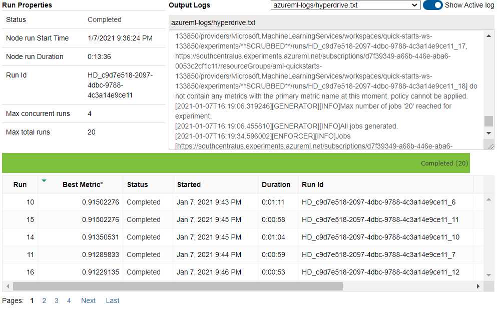
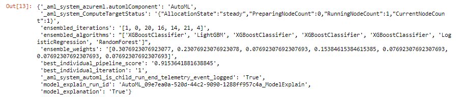
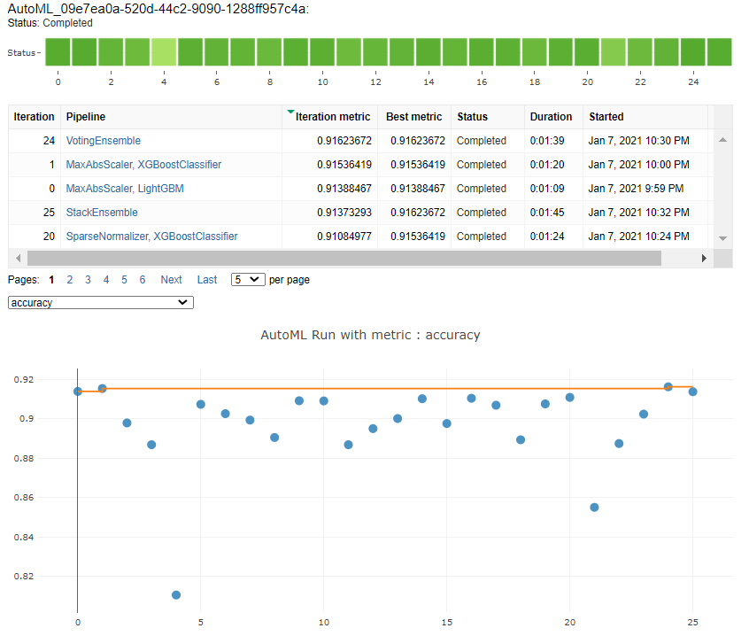

# Optimizing ML pipelines in Azure

## Overview:
This project is done as a part of Udacity's 'Machine Learning Engineer with Microsoft Azure' nanodegree course and we were given an opportunity to create and optimize an ML pipeline. We can do this process using two methods: Optimize the hyperparameters of a standard Scikit-learn Logistic Regression using HyperDrive and AutoML is used to build and optimize the model. Both the models are built on the same dataset so that they can be compared afterwards. 

## Summary:
### Dataset:
The project uses [Bank marketing dataset](http://archive.ics.uci.edu/ml/datasets/Bank+Marketing). It is related with direct marketing campaigns (phone calls) of a Portuguese banking institution and has the following attributes:
- **Input variables:** age, job, marital, education, default, housing, loan, contact, month, day_of_week, duration, campaign, pdays, previous, poutcome, emp.var.rate, cons.price.idx, cons.conf.idx, euribor3m, nr.employed
- **Output variable:** y

The classification goal is to predict if the client will subscribe a term deposit (variable y (binary: 'yes','no')).

### Solution: 
The solution can be visualized as follows:

We can use Azure ML SDK to programmatically control the pipeline with Python. This can be done using:
- **Train the model on Logistic regression algorithm and optimize the hyperparameters using HyperDrive:**  Scikit-Learn logistic regression model is used to train the dataset. Hyperparameters are adjustable parameters choosed for model training that guide the training process. The HyperDrive package helps us to automate choosing these parameters. 
- **AutoML:** Automated machine learning, also referred to as automated ML or AutoML, is the process of automating the time consuming, iterative tasks of machine learning model development. It allows us to build ML models with high scale, efficiency, and productivity all while sustaining model quality.

## Create an experiment in Workspace:
An Azure Machine Learning experiment represent the collection of trials used to validate a user's hypothesis.Here, an experiment is represented by the Experiment class and a trial is represented by the Run class. To get or create an experiment from a workspace, use Experiment() class. 

## Create a compute cluster:
With Azure Machine Learning, we can train the model on a variety of resources or environments, collectively referred to as compute targets. A compute target can be a local machine or a cloud resource, such as an Azure Machine Learning Compute, Azure HDInsight, or a remote virtual machine. AmlCompute is a managed-compute infrastructure that allows us to easily create a single or multi-node compute. To create a persistent AmlCompute resource that can be reused across jobs, we have to specify the vm_size(Virutal machine size. Eg, STANDARD_D2_V2)  and max_nodes(Maximum nodes to create. Eg, in our case: 4) parameters.

## Scikit-Learn Logistic regression pipeline: 
### Prepare data:
1. TabularDataset format is based on table based data, i.e, it helps us to handle formats like .json, .csv etc:-. Bank marketing dataset is loaded in this format for future use.
2. The data is analysed and cleaned using clean_data() user defined function and further divided into train and test sets. sklearn.model_selection.train_test_split() can be used to do this process. We can explicitely specify the test_size ie, specifies the proportion of the dataset to include in the test split (Eg, 0.2 in our case. 20% of the dataset is used for testing)
### Build and train model:
1. The dataset is trained on Scikit Learn Logistic regression model. Logistic Regression is a supervised classification algorithm that is used to predict the probability of a categorical dependent variable (ie, y). 
2. The hyperparameters are optimized using HyperDrive. 

#### HyperDrive configuration:
HyperDrive package(HyperDriveConfig) helps helps us to choose the parameters automatically. 
- **Parameter sampler:** The parameter sampling method chosen for this experimnent is Random Sampling. It supports both discrete and continuous hyperparameters. Random sampling also supports early termination of low-performance runs. For each of the hyperparameters, hyperparameter space is defined. In this experiment the defined spaces are,
              -C (inversion of regularization strength): uniform (0.01, 1), ie, It returns values uniformly distributed between 0.01 and 1.00. 
              -max-iter (maximum number of iterations): choice (100, 150, 200, 250, 300), ie, It returns a value chosen among given discrete values 100, 150, 200, 250, 300.

- **Primary metric:** The primary metric refers to the output of the process under consideration. The state of the output needs to be consistently measured, errors must be spotted and correction must be immediately made. It is therefore of vital importance to identify the correct primary metrics. Though we have explicitely specified 'accuracy' as primary metric, by default 'accuracy' itself is used for classification tasks. 

- **Early termination policy:** Bandit is an early termination policy that terminates any runs where the primary metric is not within the specified slack factor with respect to the best performing training run. In our case BanditPolicy(slack_factor = 0.1, evaluation_interval=1, delay_evaluation=5). Slack factor refers to the slack allowed with respect to the best performing training run in ratio, ie, if the best metric run is less than 0.909, it will cancel the run. evaluation_interval specifies the frequency for applying the policy, ie, everytime the training script logs the primary metric count, policy is applied. delay_evaluation specifies the number of intervals to delay the policy evaluation. The policy applies every multiple of evaluation_interval that is greater than or equal to delay_evaluation. In our case after 5 intervals the policy is delayed. 

### Deploy and analyse: 
Use 'joblib.dump()' to save the model file. Whenwe have to deploy the same model, we have to register the same saved model first and then deploy it to receive an endpoint using .register_model(). 

The results obtained after run are as follows:

## AutoML:
### Data preparation:
The data preparation step is similar to the previous method but since AutoML only accepts Azure Machine Learning TabularDatasets when working on a remote compute.Thus, convert dataframe to TabularDataset before training the set. 
### Training:
AutoML is the process of automating the process of applying machine learning to real-world problems. During training, AML creates a number of pipelines in parallel that try different algorithms and parameters for you. The service iterates through ML algorithms paired with feature selections, where each iteration produces a model with a training score. AutoML covers the complete pipeline from the raw dataset to the deployable machine learning model. AutoMLConfig() represents configuration for submitting an automated ML experiment in AML.
#### AutoML configuration:
AutoML configuration object contains and persists the parameters for configuring the experiment run, as well as the training data to be used at run time. 
experiment_timeout_hours, task, Primary metric, n_cross_validations, compute_target, training_data, label_column_name are the parameters specified. 

The hyperparameters chosen by the algorithm are as follows:

where, 

**ensembled_iterations** refers to number of iterations in the algorithm, **min_impurity_split** refers to Impurity threshold for early stopping in tree growth of Random forest, **weights** refer to strength of the parameters that needs to be passed. In the Random Forest algorithm, a split point at any depth will only be considered if it leaves at least **min_samples_leaf training** samples in each of the left and right branches. **min_samples_split** refers to minimum number of samples required to split an internal node, **min_weight_fraction_leaf** refers to the minimum weighted fraction of the sum total of weights required to be at a leaf node, **n_estimators** refers to the number of trees in the algorithm and **n_jobs** refers to the number of jobs to run in parallel. 

### Deploy and analyse: 
The best model deployment step is similar to the previous method. 

The results obtained after run are as follows:

## Best model comparison:
The result obtained after training Scikit learn is as follows: 

Voting Ensemble was selected as the optimal model by the AutoML run. It is an ensemble machine learning model that combines the predictions from multiple other models (Eg, Decision tree classifier, Random forest etc:-). It is a technique that may be used to improve model performance, ideally achieving better performance than any single model used in the ensemble.The results obtained after executing are as follows: 

There isn't a significant difference in the accuracy of the models. A slight increase in case of 'Voting ensemble' might be due to the reason that it is more stable and gives better prediction as the aggregate opinion of multiple models is less noisy than other models.
The traditional scikit-learn based method took 9'33" mins to run, whereas AutoML took _ mins to execute. Though overall AutoML took more time, 'Voting Ensemble' just took _ mins to run. 
Though in this project training using AutoML works fairly better than traditional method, by changing a few parameters we can increase the performance of Scikit-learn based model. 

## Future improvements:
- In case of scikit-learn based model, A different parameter sampler (Eg, Grid sampling or Bayesian sampling) can be used. Early stopping is mainly for iterative solutions, like Grid sampling. It is mainly used to terminate processes when a run gets stuck and does not improve over a couple of iterations. Analyze the performance by removing the bandit policy. Other parameters (max_total_runs, max_concurrent_runs, primary_metric) can be changed to optimize the pipeline. 
- In case of AutoML run, we got an Imbalanced data warning. This can lead to a falsely perceived positive effect of a model's accuracy because the input data has bias towards one class. Run the AutoML process after recifying the same. Also try to run the AutoML run longer by removing the 30mins time limit. 

## Proof of cluster clean up:
Cluster clean up frees the computer resources, it can be done by deleting the compute instance. Proof is provided below. 

## References:
- [Microsoft Documentations](https://docs.microsoft.com/en-us/documentation/)
- [Udacity course contents- Machine learning engineer for Microsoft Azure](https://www.udacity.com/course/machine-learning-engineer-for-microsoft-azure-nanodegree--nd00333)
